# Manual de Usuario Corporativo: Operaciones Integradas en Odoo ERP

Este manual está diseñado paso a paso para personas con conocimientos básicos de computadoras. Cada módulo explica exactamente dónde hacer clic, qué campo rellenar y muestra imágenes con recuadros rojos explicativos.

---

## 1. Módulo de Contactos (Fichas de Clientes)

Este módulo sirve para guardar y organizar los datos de tus clientes (personas o empresas). Mantenerlo al día evita problemas con la SUNAT en facturas electrónicas.

### 1.1 Ver Listado de Clientes (Leer)
1. En tu pantalla de inicio de Odoo, busca el icono que dice **Contactos** y haz clic sobre él.
2. Verás una pantalla con tarjetas de los clientes creados.

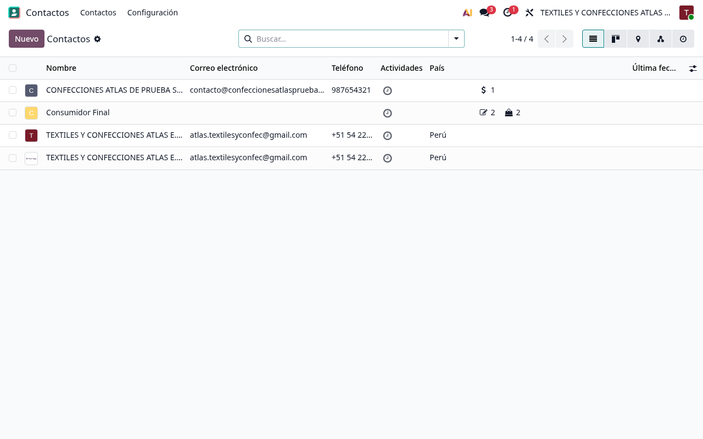

### 1.2 ¿Cómo Buscar Clientes rápidamente?
1. En la parte superior derecha de la pantalla de Contactos verás una barra con una pequeña lupa.
2. Haz clic dentro de esta barra de búsqueda.
3. Escribe lo que buscas (por ejemplo: el nombre de la empresa, el RUC o el teléfono).
4. Presiona **Enter** y la pantalla ocultará temporalmente a los demás clientes, mostrando solo el que escribiste.

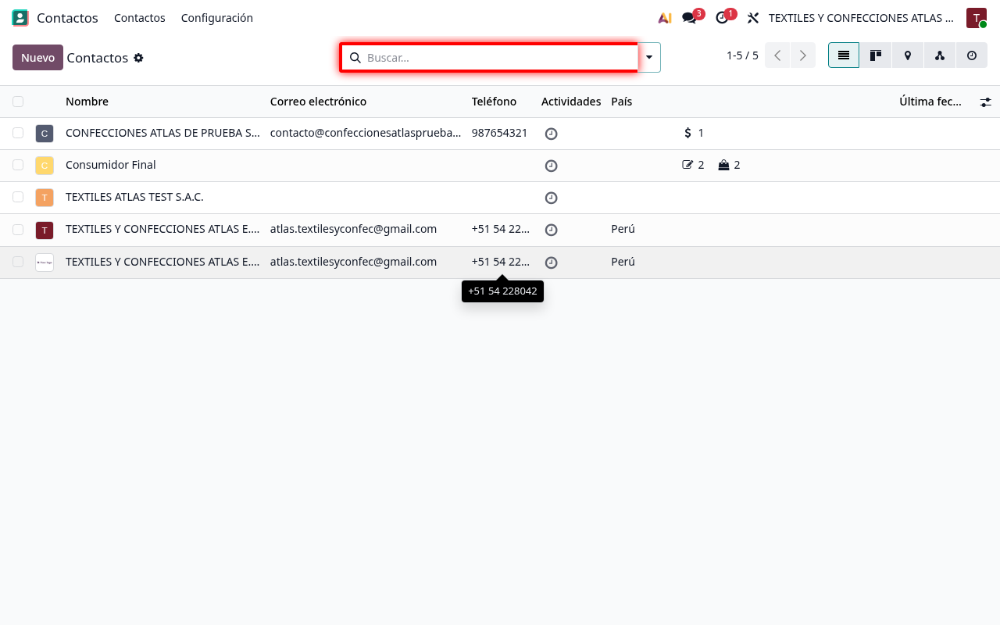
*Figura 1.1: Barra de búsqueda superior para encontrar clientes por nombre, RUC o datos de contacto.*

### 1.3 Uso de Filtros y Agrupadores (Ordenar a tus clientes)
Para segmentar a tu cliente rápidamente sin tener que buscar uno por uno:
1. Haz clic en el botón **Filtros** que está justo debajo de la barra de búsqueda.
   * *Ejemplo de uso:* Si solo quieres ver a las empresas registradas (personas jurídicas) y ocultar a las personas naturales, selecciona el filtro **Compañías**.
2. Haz clic en **Agrupar por**:
   * *Ejemplo de uso:* Si tienes clientes en distintos departamentos del Perú y deseas ordenarlos visualmente por su ubicación, haz clic en **País/Estado** o **Ciudad**. Odoo los dividirá de forma ordenada en bloques agrupados.

### 1.4 Cambiar de Vistas (Tarjetas vs. Tablas)
En la parte superior derecha verás tres pequeños botones para cambiar la forma en que se muestra la información:
* **Vista Kanban (Tarjetas):** Muestra cada cliente en un recuadro individual con su foto y datos rápidos (Ideal para uso táctil en tablets).
* **Vista Lista (Tabla):** Muestra a los clientes en una tabla compacta como una hoja de Excel. Es la mejor opción cuando necesitas comparar datos rápidamente.
* **Vista Mapa:** Muestra la ubicación geográfica del cliente en Google Maps (si rellenó la dirección correcta).

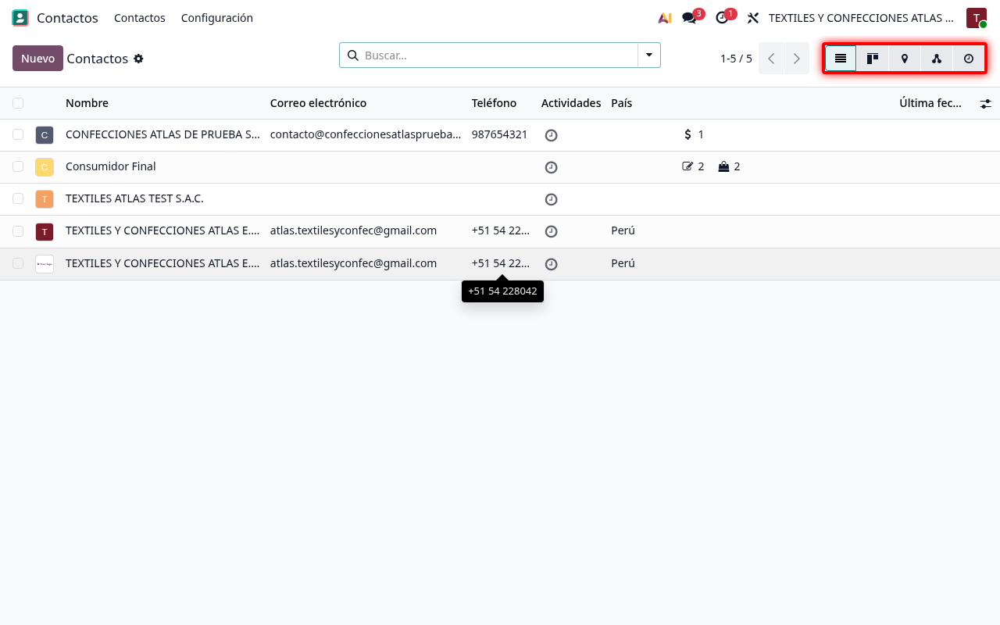
*Figura 1.2: Botones para alternar entre las vistas Kanban (tarjetas) y Lista (tabla) en Odoo.*

### 1.5 Hacer clic en Crear Nuevo Cliente
1. Ubica el botón **Nuevo** en la parte superior izquierda (enmarcado en rojo).
2. Haz clic sobre él.

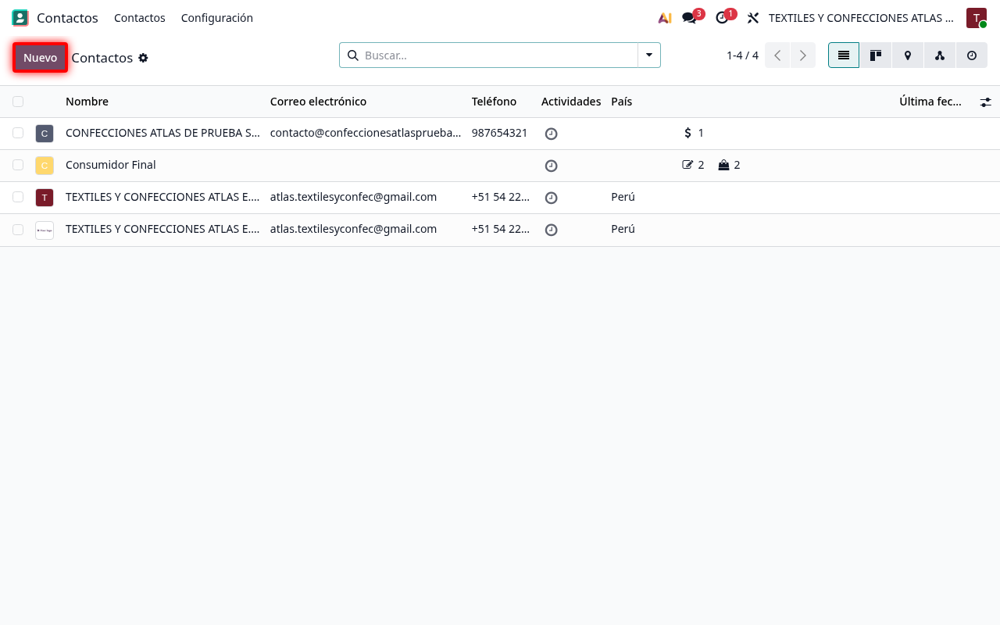

### 1.6 Rellenar la Ficha del Cliente (Ejemplo Práctico)
1. En el campo **Nombre**, escribe el nombre del cliente o empresa (Ejemplo: `TEXTILES ATLAS TEST S.A.C.`).
2. En **Identificación Fiscal**, selecciona **RUC** o **DNI**.
3. En el campo **Número de Identificación**, escribe el número correspondiente (Ejemplo: `20123456789`).
4. Haz clic en **Guardar** (el icono de la nube en la parte superior izquierda).

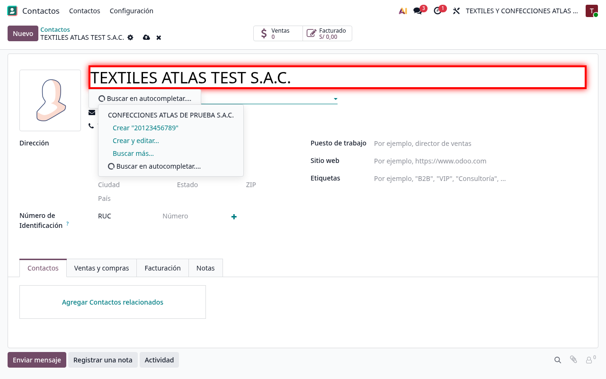
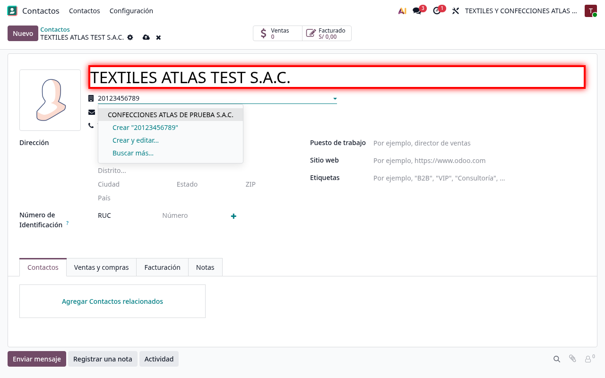

---

## 2. El Chatter: El Historial y Centro de Mensajería de Odoo

El **Chatter** (sección de comunicación) es una de las herramientas más importantes de Odoo. Se encuentra en el lateral derecho de **todas las fichas** de Odoo (Contactos, Ventas, Inventario, etc.).

Sirve como una bitácora o cuaderno de notas donde se registra todo lo que pasa con ese cliente para que cualquier trabajador del negocio esté enterado.

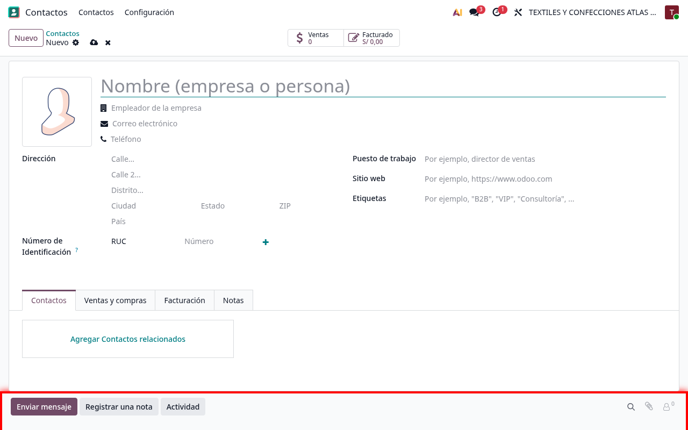
*Figura 2.1: Panel del Chatter en el costado derecho de la ficha del contacto.*

### 2.1 Enviar Mensaje (Comunicación Directa)
* **¿Para qué sirve?:** Para enviar correos electrónicos al cliente directamente desde Odoo, sin abrir Outlook o Gmail.
* **¿Cómo se hace?:**
  1. Haz clic en **Enviar mensaje**.
  2. Escribe tu texto.
  3. Haz clic en **Enviar**. El cliente recibirá el correo y si responde, su respuesta aparecerá automáticamente en esta misma sección.

### 2.2 Poner Nota (Bitácora Interna)
* **¿Para qué sirve?:** Para apuntar cosas importantes sobre el cliente que solo tus compañeros de trabajo deben ver (el cliente NO recibe correos de estas notas).
* **¿Cómo se hace?:**
  1. Haz clic en **Poner nota**.
  2. Escribe datos útiles como: *"Este cliente prefiere que le enviemos las cotizaciones los martes por la mañana"*.
  3. Haz clic en **Registrar nota**.

### 2.3 Planificar Actividad (Recordatorios)
* **¿Para qué sirve?:** Para que Odoo te recuerde hacer una tarea con el cliente (Llamarlo, enviarle una cotización, realizar una visita) en una fecha específica.
* **¿Cómo se hace?:**
  1. Haz clic en **Planificar actividad** (icono de reloj).
  2. Selecciona el tipo de actividad (ej. *Llamar*).
  3. Coloca la fecha límite y una descripción rápida.
  4. Haz clic en **Planificar**. Odoo te enviará una alerta en la mañana del día acordado para recordártelo.

---

## 3. Módulo de Inventario (Gestión de Productos)

Aquí podrás ver qué prendas tienes disponibles y añadir nuevas al catálogo de la tienda.

### 3.1 Ver Catálogo de Productos (Leer)
1. Haz clic en el botón de **Inventario** en el menú de aplicaciones de Odoo.
2. Selecciona **Productos** en el menú de arriba.

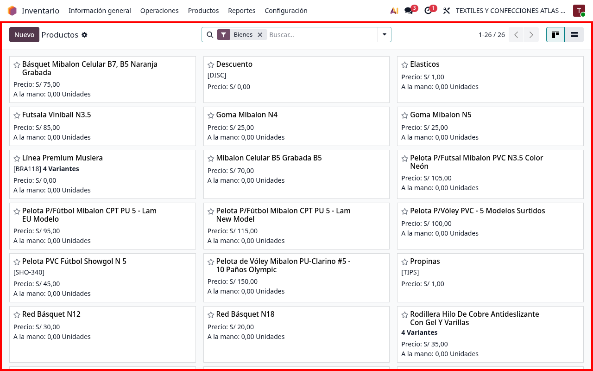

### 3.2 Crear un Producto Nuevo (Ejemplo Práctico)
1. Haz clic en el botón **Nuevo** en la esquina superior izquierda.
2. Completa los campos solicitados:
   * **Nombre del Producto:** Escribe el nombre de la prenda (Ejemplo: `Casaca Térmica Impermeable Talla L`).
   * **Tipo de Producto:** Selecciona **Almacenable** para llevar control de unidades.
   * **Precio de Venta:** Escribe el precio en Soles (Ejemplo: `120.00`).
3. Presiona **Guardar**.

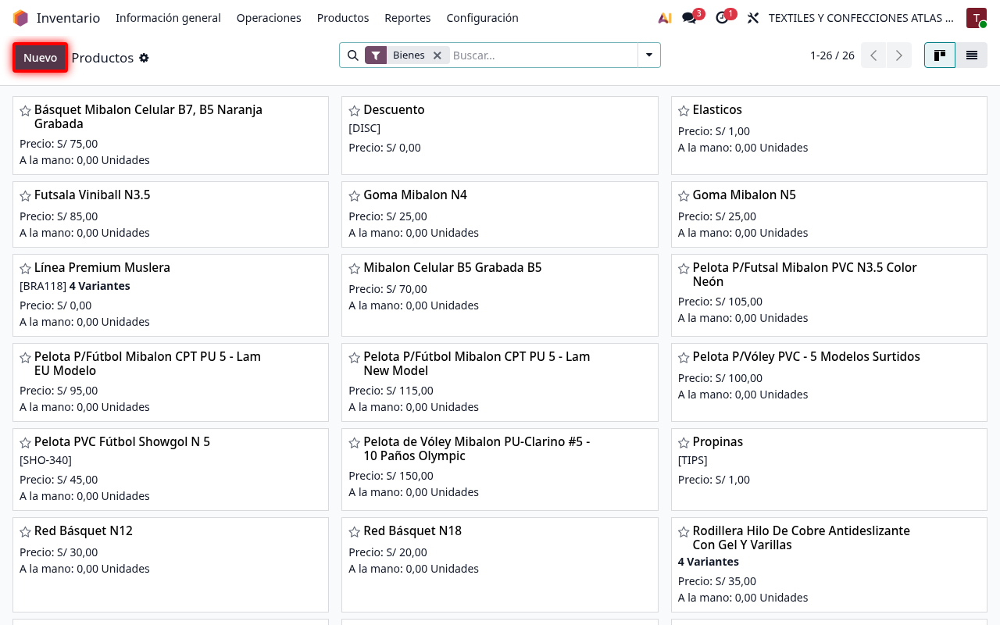
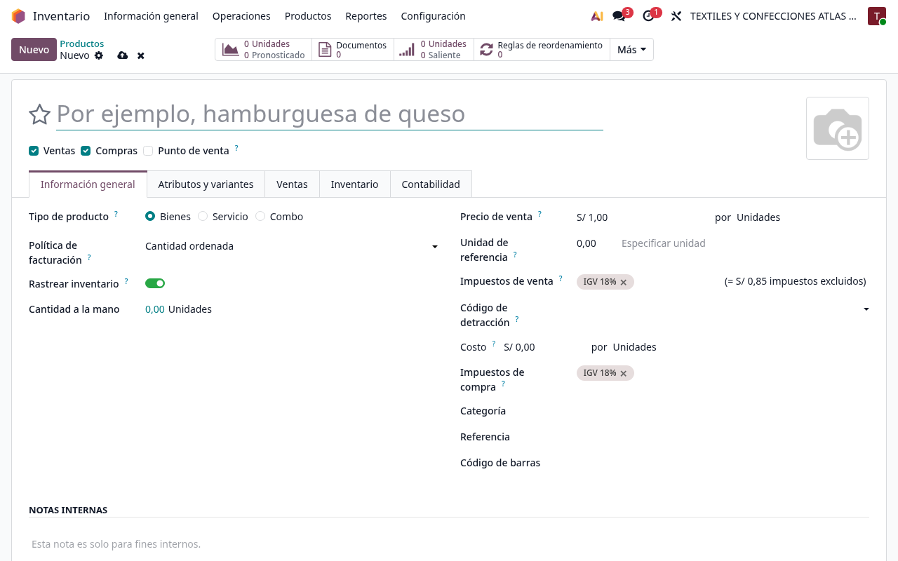
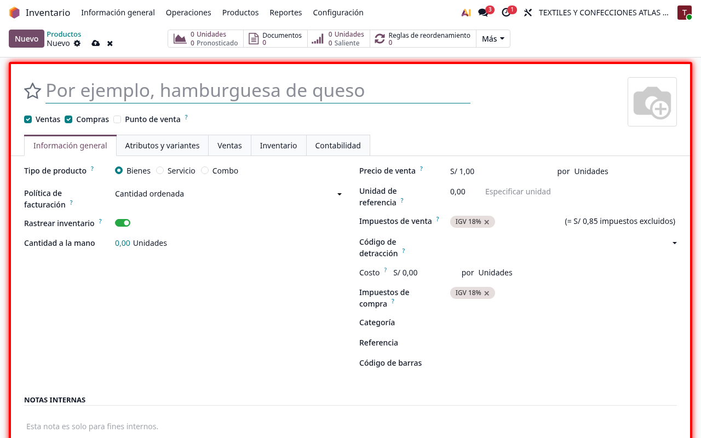

---

## 4. Módulo de Punto de Venta (PoS - Operaciones de Caja)

Este es el módulo que utilizarás para vender rápido cara a cara al cliente en mostrador.

### 4.1 Abrir la Caja del Día
1. Haz clic en el módulo **Punto de Venta**.
2. Ubica tu caja y haz clic en el botón **Nueva Sesión** o **Continuar** (enmarcado en rojo).

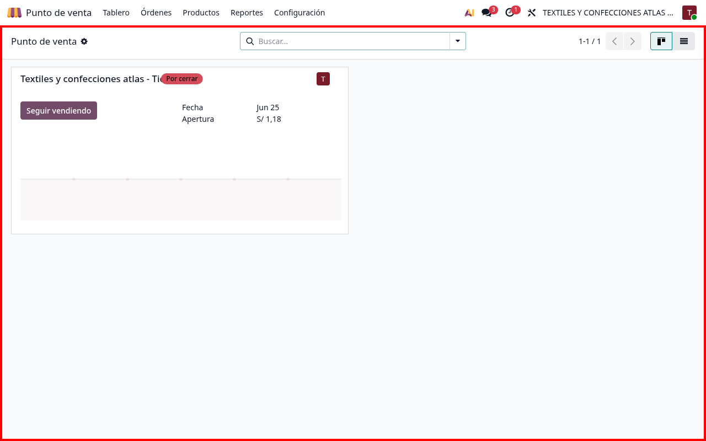
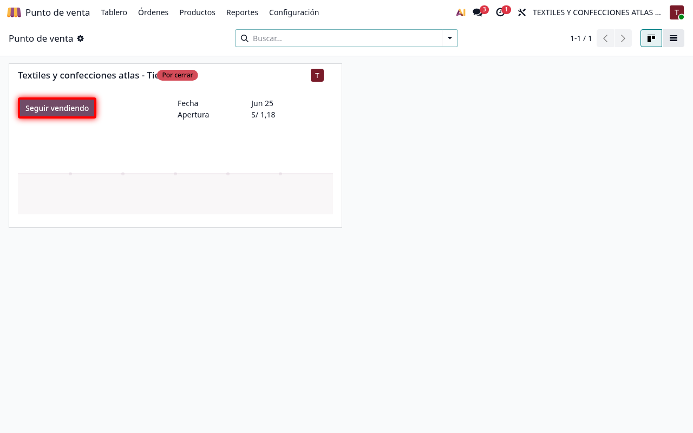

### 4.2 Cobro y emisión de Boleta/Factura
1. Haz clic sobre los productos a vender para cargarlos al carrito izquierdo.
2. Haz clic en el botón verde grande que dice **Pago**.
3. Elige el **Método de Pago** (Efectivo o Tarjeta).
4. Elige a la derecha si deseas emitir una **Factura** (obligatorio tener RUC del cliente) o **Boleta/Recibo**.
5. Haz clic en **Validar** para finalizar la venta e imprimir.

---

## 5. Módulo de Ventas B2B (Cotizaciones Mayoristas)

Se usa para pedidos grandes o ventas corporativas donde el cliente solicita un presupuesto formal antes de pagar.

### 5.1 Ver Historial de Ventas
1. Haz clic en el módulo **Ventas**.
2. Verás la lista de cotizaciones existentes y su estado (Borrador, Confirmado).

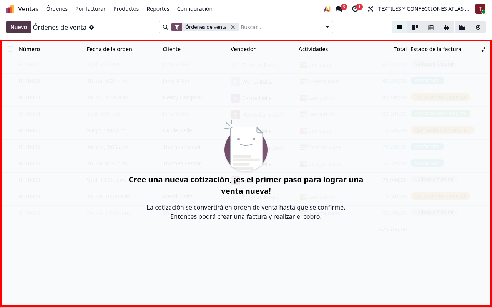

### 5.2 Crear una Cotización de Venta (Ejemplo Práctico)
1. Haz clic en **Nuevo** arriba a la izquierda.
2. Selecciona al **Cliente** de la lista desplegable.
3. En la sección de abajo, haz clic en **Agregar un producto** y selecciona la prenda y la cantidad (Ejemplo: 50 unidades de `Casaca Térmica Impermeable Talla L`).
4. Haz clic en **Confirmar** para concretar el pedido de venta.

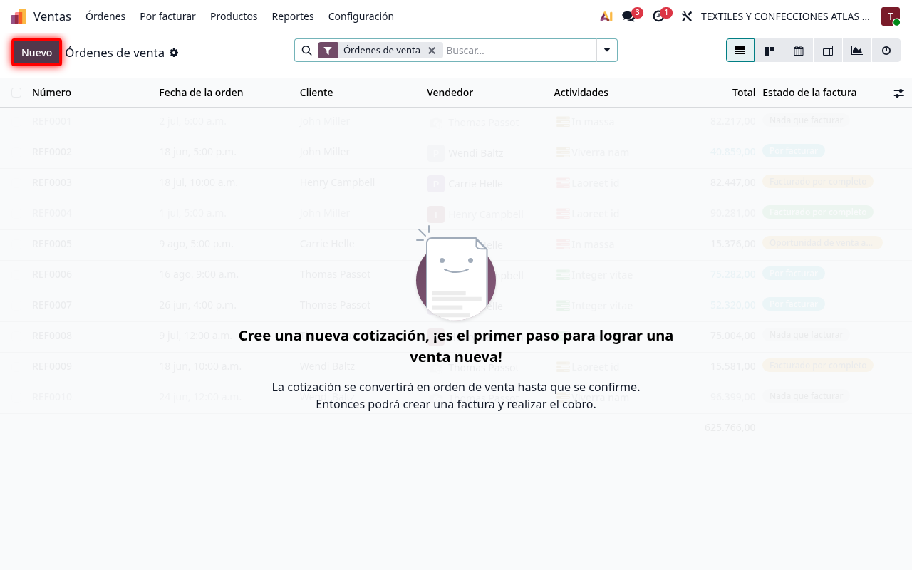
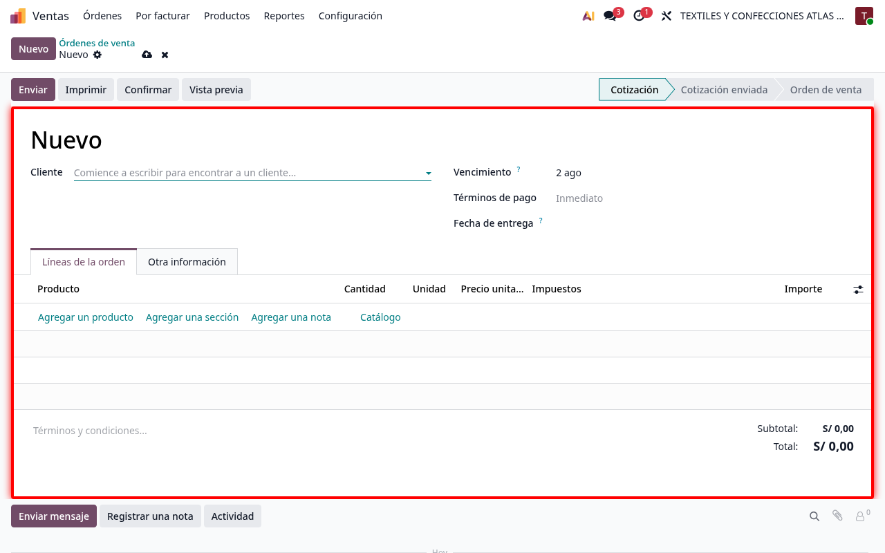
